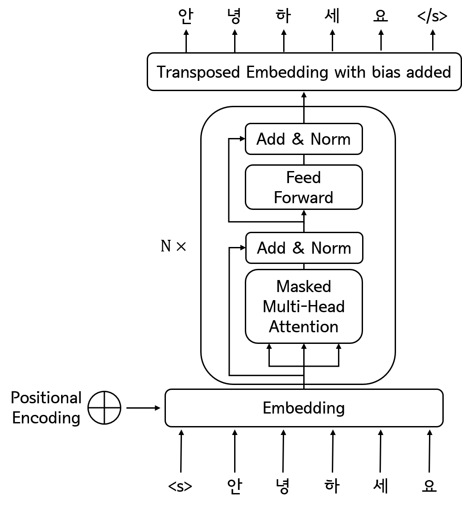

# char-bert-lm
Character-level BERT-style Language Model Implementation in Tensorflow 2

## Developers
* Younglo Lee (yllee@ispl.korea.ac.kr)

## Contents
  * [Contents](#contents)
  * [Character-level Language Model](#languagemodel)
  * [Features](#features)
  * [Prerequisites](#prerequisites)
  * [Examples](#examples)
  * [References](#references)
    
## Character-level Language Model
- Tensorflow 2 implementation for character-level BERT language model

## Features
- Korean character(syllable)-level language model

## Prerequisites
- Python 3.x
- Tensorflow 2.2.0
- etc.

## References and Resources
- https://www.tensorflow.org/tutorials/text/transformer
- https://github.com/ratsgo/embedding
